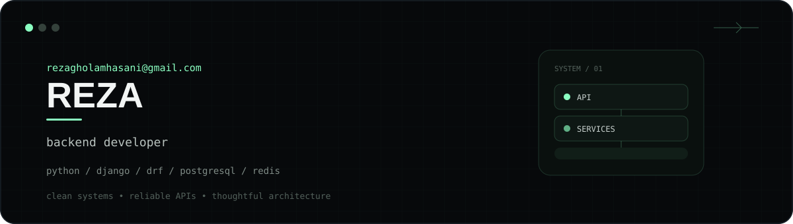

<div align="center">

<a href="https://github.com/rezagh100">
  
</a>

<br />

<a href="https://github.com/rezagh100">
  
</a>
<a href="https://www.python.org/">
  
</a>
<a href="https://www.djangoproject.com/">
  
</a>
<a href="https://www.django-rest-framework.org/">
  
</a>

</div>

<br />

## `01` — About

I’m a backend developer focused on **Python, Django, and Django REST Framework**.

I care about writing software that is easy to understand, reliable in production, and structured to grow with the product.

```text
API design          →  clean, predictable interfaces
Business logic      →  explicit, maintainable services
Data                →  PostgreSQL-first thinking
Performance         →  caching, query optimization, async work
Delivery            →  Git, Docker, Linux
```

## `02` — Stack

<div align="center">


</div>

## `03` — Principles

<table>
<tr>
<td width="33%" valign="top">

### Clean

Readable code, clear boundaries, and abstractions that earn their complexity.

</td>
<td width="33%" valign="top">

### Reliable

Validation, authentication, transactions, testing, and failure-aware design.

</td>
<td width="33%" valign="top">

### Scalable

Efficient queries, caching, background jobs, and architecture that can evolve.

</td>
</tr>
</table>

## `04` — GitHub

<div align="center">


<br /><br />


</div>

## `05` — A small philosophy

> **Good backend code disappears behind a great product.**
>
> The API should feel boring. The architecture should feel intentional. The system should keep working.

<div align="center">

<br />

`Python` · `Django` · `DRF` · `PostgreSQL` · `Redis` · `Celery` · `Docker`

<br /><br />

<a href="https://github.com/rezagh100">
  
</a>

<br /><br />

**Building the backend. Powering the experience.**

</div>
